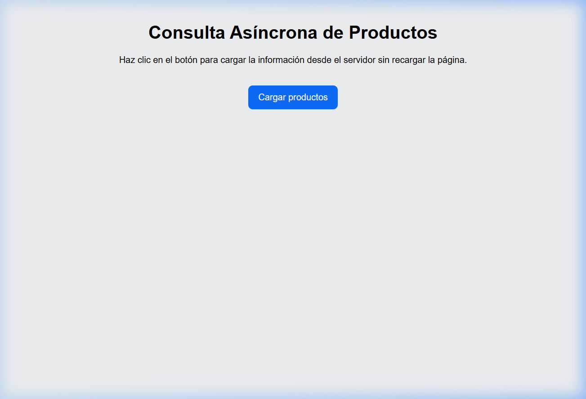
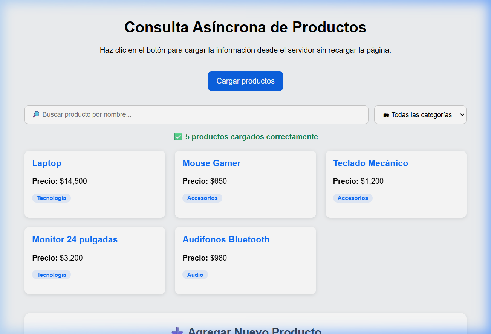
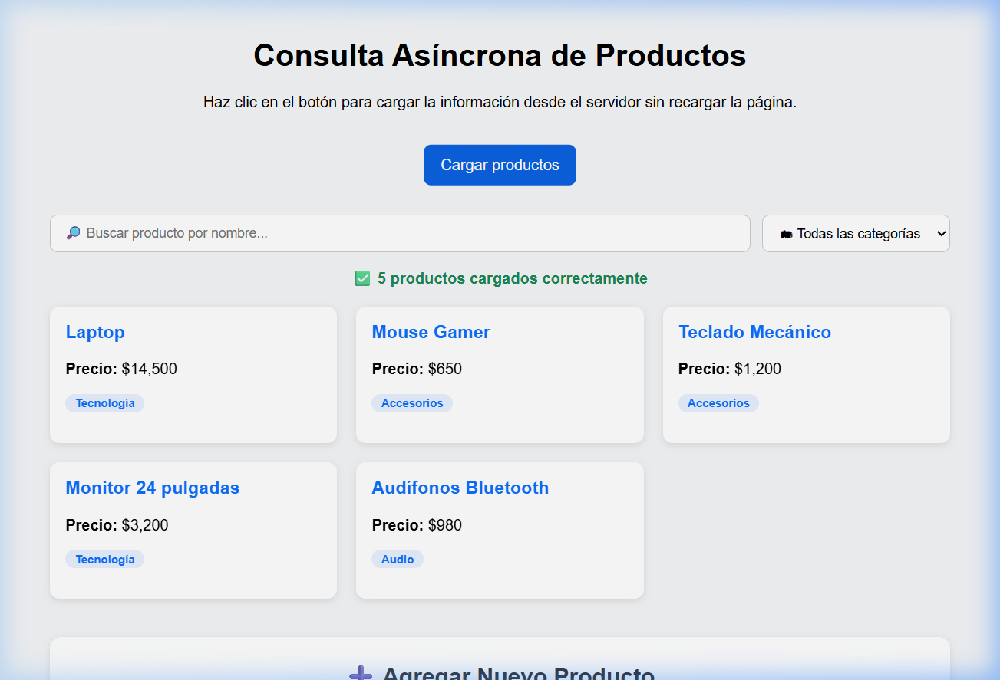
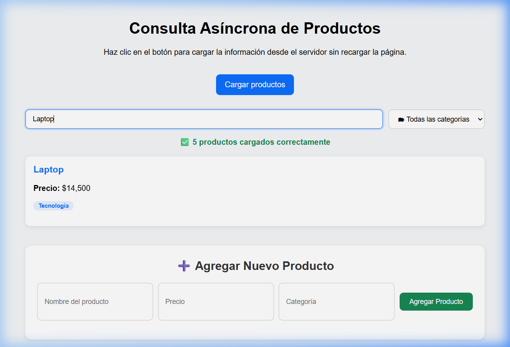
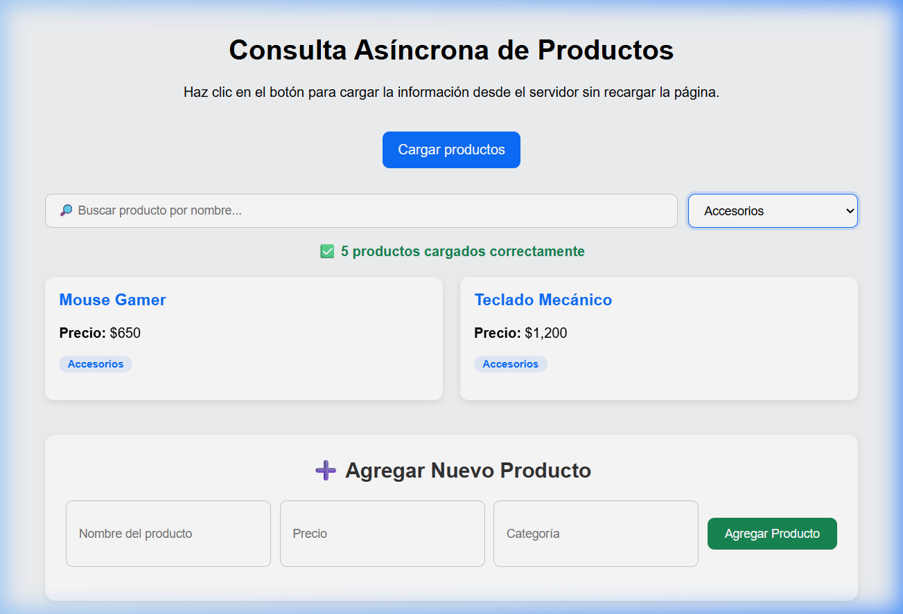
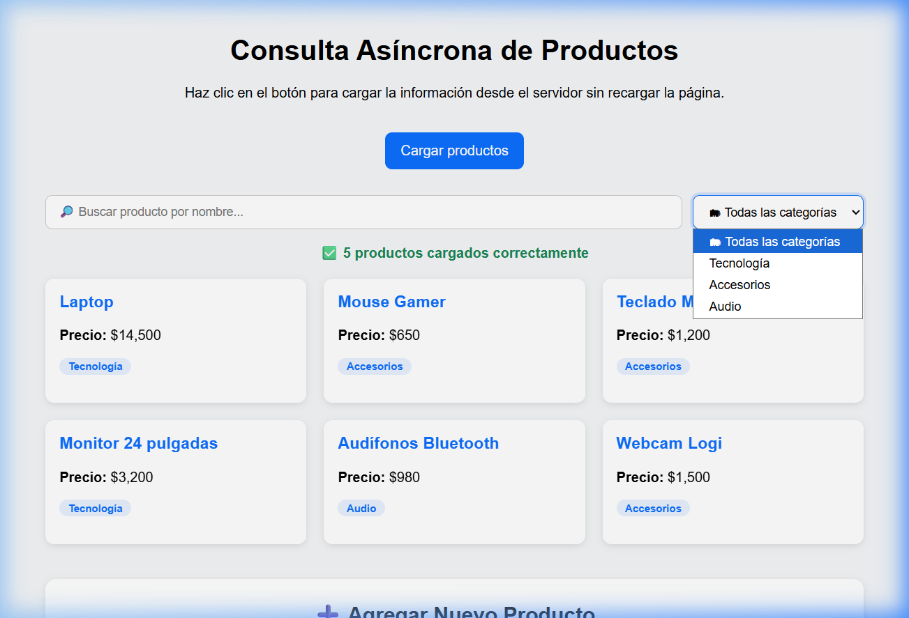

# Práctica: Presentación Asíncrona de Información en un Sitio Web

**Asignatura:** Desarrollo Web Profesional  
**Unidad:** II – Sitios Web Dinámicos  
**Tema:** Presentación asíncrona de información  
**IDE:** Visual Studio Code

---

## 📂 Estructura del Proyecto

```
practica-asincrona-web/
├── public/
│   ├── index.html      # Interfaz de usuario
│   ├── styles.css       # Estilos CSS
│   └── app.js           # Lógica asíncrona del cliente
├── evidencias/          # Capturas y video
├── server.js            # Servidor Express con API REST
├── package.json         # Dependencias del proyecto
├── .gitignore           # Archivos ignorados por Git
└── README.md            # Este informe
```

---

## ⚙️ Instrucciones para Ejecutar

1. Clonar el repositorio
2. Instalar dependencias:
   ```bash
   npm install
   ```
3. Iniciar el servidor:
   ```bash
   node server.js
   ```
4. Abrir en el navegador: `http://localhost:3000`
5. Presionar el botón **"Cargar productos"**

---

## 🔎 Explicación del Flujo Asíncrono

El proyecto implementa una comunicación **cliente-servidor asíncrona** que funciona de la siguiente manera:

1. **El usuario presiona el botón** "Cargar productos" en la interfaz.
2. **Se muestra una animación de carga** (spinner) para indicar que se está procesando la solicitud.
3. **El cliente (app.js) envía una petición HTTP GET** al endpoint `/api/productos` usando la **Fetch API** con `async/await`.
4. **El servidor (server.js) procesa la petición** y simula un retardo de 1.5 segundos (para demostrar la naturaleza asíncrona) antes de devolver los datos en formato **JSON**.
5. **El cliente recibe la respuesta JSON**, la convierte a objetos JavaScript y **actualiza el DOM dinámicamente**, creando tarjetas HTML para cada producto.
6. **En ningún momento se recarga la página completa**, lo que mejora la experiencia del usuario y la velocidad de la aplicación.

### Diagrama del flujo:

```
[Usuario] → Click → [JavaScript (Fetch API)] → Petición HTTP → [Servidor Express]
                                                                       ↓
[DOM actualizado] ← Renderizar tarjetas ← Datos JSON ← Respuesta HTTP ←
```

---

## 🧪 Actividades de Investigación

### Actividad 1: Peticiones Asíncronas

**¿Qué significa una petición asíncrona?**

Una petición asíncrona es aquella que se ejecuta en segundo plano **sin bloquear el hilo principal** de la aplicación. Esto significa que mientras la petición se envía al servidor y se espera la respuesta, el usuario puede seguir interactuando con la página normalmente. El navegador "registra" que hay una operación pendiente y, cuando la respuesta llega, ejecuta el código correspondiente para procesarla. Es como enviar un mensaje de WhatsApp: no te quedas mirando la pantalla esperando la respuesta, sino que sigues haciendo otras cosas y cuando llega la respuesta, la lees.

**¿Qué ventajas tiene frente a recargar la página?**

| Aspecto | Recarga completa | Petición asíncrona |
|---------|------------------|--------------------|
| Experiencia de usuario | Pantalla en blanco durante la recarga | Interfaz fluida, sin interrupciones |
| Rendimiento | Se descarga todo el HTML, CSS, y JS de nuevo | Solo se transfieren los datos necesarios (JSON) |
| Velocidad | Más lenta (recarga todos los recursos) | Más rápida (solo los datos cambian) |
| Estado de la interfaz | Se pierde (formularios, scroll, etc.) | Se mantiene intacto |
| Consumo de ancho de banda | Alto | Bajo |

---

### Actividad 2: Descripción de Herramientas

**Fetch API**  
Es una interfaz moderna de JavaScript que permite realizar peticiones HTTP a servidores de forma asíncrona. Reemplaza al antiguo `XMLHttpRequest` con una sintaxis más limpia basada en Promesas. Ejemplo: `fetch('/api/productos')` envía una petición GET y devuelve una Promesa que se resuelve con la respuesta del servidor.

**async / await**  
Son palabras clave de JavaScript que simplifican el manejo de operaciones asíncronas. `async` se coloca antes de una función para indicar que contendrá código asíncrono, y `await` se usa dentro de esa función para "esperar" a que una Promesa se resuelva, haciendo que el código asíncrono se lea de forma secuencial y más comprensible.

**JSON (JavaScript Object Notation)**  
Es un formato ligero de intercambio de datos basado en texto. Es fácil de leer para humanos y fácil de parsear para máquinas. Se utiliza como el formato estándar para enviar y recibir datos entre cliente y servidor en aplicaciones web modernas. Ejemplo: `{ "nombre": "Laptop", "precio": 14500 }`.

**DOM (Document Object Model)**  
Es la representación en memoria de la estructura HTML de una página web como un árbol de objetos. JavaScript puede manipular el DOM para agregar, modificar o eliminar elementos HTML dinámicamente sin necesidad de recargar la página. En este proyecto, usamos `document.createElement()`, `appendChild()`, y `innerHTML` para crear las tarjetas de productos.

**Express**  
Es un framework minimalista para Node.js que facilita la creación de servidores web y APIs REST. Permite definir rutas (endpoints), manejar peticiones HTTP, servir archivos estáticos y gestionar middleware de forma sencilla. En este proyecto, Express sirve los archivos estáticos de la carpeta `public/` y expone el endpoint `/api/productos`.

---

### Actividad 3: Identificación en el Código

**¿Dónde se hace la petición al servidor?**

En el archivo `app.js`, dentro de la función `cargarProductos()`:

```javascript
const respuesta = await fetch('/api/productos');
```

Esta línea envía una petición HTTP GET al endpoint `/api/productos` del servidor Express.

**¿Dónde se reciben los datos?**

Inmediatamente después de la petición, se convierte la respuesta a JSON:

```javascript
const productos = await respuesta.json();
```

Aquí se reciben los datos del servidor y se transforman de texto JSON a un array de objetos JavaScript.

**¿Dónde se actualiza la interfaz?**

En la función `renderizarProductos()`, donde se manipula el DOM:

```javascript
productos.forEach((producto, index) => {
  const tarjeta = document.createElement('div');
  tarjeta.classList.add('tarjeta');
  tarjeta.innerHTML = `
    <h3>${producto.nombre}</h3>
    <p><strong>Precio:</strong> $${producto.precio.toLocaleString('es-MX')}</p>
    <p><span class="categoria-badge">${producto.categoria}</span></p>
  `;
  listaProductos.appendChild(tarjeta);
});
```

Aquí se crean dinámicamente los elementos HTML (tarjetas) y se agregan al contenedor `listaProductos` en el DOM.

---

## 🚀 Mejoras Implementadas

Se implementaron **4 mejoras** al proyecto base:

### 1. 🔎 Buscador de productos
Se agregó un campo de texto que permite buscar productos por nombre **en tiempo real**. A medida que el usuario escribe, se filtran los productos que coinciden con el texto ingresado. Esto se logra con un listener en el evento `input` que ejecuta la función `filtrarProductos()`.

### 2. 🗂 Filtro por categoría
Se agregó un menú desplegable (`select`) que permite filtrar productos por categoría (Tecnología, Accesorios, Audio). Las categorías se generan dinámicamente a partir de los productos cargados usando `[...new Set(productos.map(p => p.categoria))]` para obtener valores únicos.

### 3. ⏳ Animación de carga (Spinner)
Se implementó un spinner CSS animado que se muestra mientras se espera la respuesta del servidor (durante el retardo simulado de 1.5 segundos). Esto proporciona retroalimentación visual al usuario de que la aplicación está procesando su solicitud.

### 4. ➕ Formulario para agregar productos
Se agregó un formulario que permite al usuario crear nuevos productos mediante una petición **POST asíncrona** al servidor. El nuevo producto se almacena en el array del servidor y se actualiza la interfaz automáticamente sin recargar la página. Esto demuestra el uso bidireccional de Fetch API.

### (Bonus) ❌ Mensaje "sin resultados"
Cuando la búsqueda o el filtro no coinciden con ningún producto, se muestra un mensaje amigable de "No se encontraron productos" en lugar de dejar el espacio vacío.

---

## 📷 Evidencias de Funcionamiento

### 1. Estado inicial de la aplicación


### 2. Animación de carga (spinner)


### 3. Productos cargados correctamente


### 4. Búsqueda de productos (filtro por nombre)


### 5. Filtro por categoría (Accesorios)


### 6. Producto nuevo agregado


### 🎬 Video de funcionamiento
El video de demostración del funcionamiento completo se encuentra en `evidencias/video-funcionamiento.webp`.

---

## 📊 Criterios de Evaluación

| Criterio | Porcentaje | Estado |
|----------|------------|--------|
| Funcionamiento del servidor | 25% | ✅ Servidor Express con endpoints GET y POST |
| Implementación de consulta asíncrona | 25% | ✅ Fetch API + async/await |
| Actualización dinámica del DOM | 20% | ✅ Creación dinámica de tarjetas, buscador y filtros |
| Manejo de errores | 15% | ✅ try/catch con mensajes al usuario |
| Explicación de herramientas | 15% | ✅ Documentado en este README |

---

## 🛠 Herramientas Utilizadas

| Herramienta | Uso |
|-------------|-----|
| Visual Studio Code | IDE para desarrollar el proyecto |
| Node.js | Ejecutar servidor local |
| Express | Crear API REST sencilla |
| HTML | Estructura de la interfaz |
| CSS | Estilos y animaciones |
| JavaScript | Lógica asíncrona de la aplicación |
| Fetch API | Peticiones asíncronas (GET y POST) |
| JSON | Formato de intercambio de datos |
| DOM | Actualización dinámica del contenido |
| Git + GitHub | Control de versiones y repositorio remoto |

---

## 📚 Recursos de Apoyo

- [Fetch API - MDN](https://developer.mozilla.org/es/docs/Web/API/Fetch_API)
- [async function - MDN](https://developer.mozilla.org/es/docs/Web/JavaScript/Reference/Statements/async_function)
- [Express.js](https://expressjs.com)
- [Visual Studio Code](https://code.visualstudio.com/docs)

---

## 💡 Conclusión

Esta práctica permitió comprender cómo funciona el **intercambio asíncrono de información entre cliente y servidor**, una técnica fundamental para el desarrollo de aplicaciones web modernas. Se demostró cómo usar **Fetch API** con **async/await** para obtener datos en formato **JSON** desde un servidor **Express**, y cómo manipular el **DOM** para actualizar la interfaz de forma dinámica sin recargar la página completa. Las mejoras implementadas (buscador, filtro, animación de carga y formulario) refuerzan estos conceptos y muestran el potencial de las aplicaciones web interactivas.
